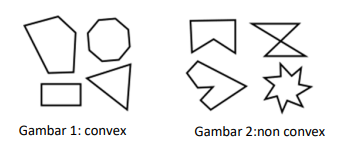

# Tugas Kecil 2 IF2211 Strategi Algoritma Semester II tahun 2021/2022

## Implementasi Convex Hull untuk Visualisasi Tes Linear Separability Dataset dengan Algoritma Divide and Conquer

Pada Tucil kali ini akan dibuat sebuah pustaka (library) myConvexHull dalam bahasa Python yang dapat mengembalikan convex hull dari kumpulan data 2 dimensi (dapat dianggap kumpulan titik 2 dimensi). Himpunan titik pada bidang planar disebut convex jika untuk sembarang dua titik pada bidang tersebut (misal p dan q), seluruh segmen garis yang berakhir di p dan q berada pada himpunan tersebut. Contoh gambar 1 adalah poligon yang convex, sedangkan gambar 2 menunjukkan contoh yang non-convex.



## Disusun Oleh

```
Nama  : Mahesa Lizardy
NIM   : 13520116
Kelas : 2
```

## Cara Penggunaan

lakukan command berikut pada terminal

```
python src/main.py
```

setelah itu akan ditampilkan hasil convex hull dari dataset yang dipilih

# !!!!Tentang Kode!!!!

Perlu diperhatikan pada file main.py data default yang digunakan adalah dataset iris dengan sumbu x adalah data sepal length (indeks tabel 0) dan sumbu y adalah sepal witdh (indeks tabel 1). Untuk itu jika ingin mengganti dataset dapat melakukan hal-hal berikut

## Mengganti dataset

Sebelum mengganti dataset perlu diperhatikan dataset yang dapat digunakan pada kode ini yaitu (wine dan breast_cancer). Pada kode ini default dasaet yang digunakan adalah dataset iris. Untuk mengganti dataset, Pada file main.py ganti dataset menjadi data yang lain pada

```
data = datasets.load_iris()
```

berikut data yang dapat digunakan

1. wine

```
data = datasets.load_iris()
```

2. breast_cancer

```
data = datasets.load_breast_cancer()
```

## Mengganti kolom

Sebelum mengganti kolom tabel perlu diperhatikan indeks kolom yang digunakan tidak melebihi kolom dataset yang ada. Default kolom dataset yang digunakan pada kode ini adalah 0 dan 1. Untuk mengganti kolom dapat mengganti kode pada file main.py berikut ini

```
plt.xlabel(data.feature_names[0])
plt.ylabel(data.feature_names[1])
```

dan

```
bucket = bucket.iloc[:, [0, 1]].values
```
